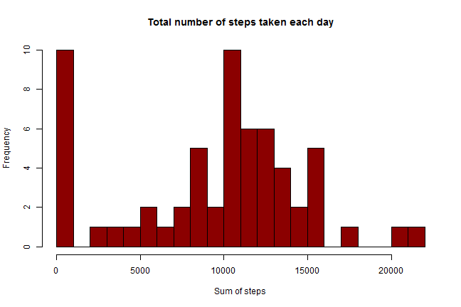
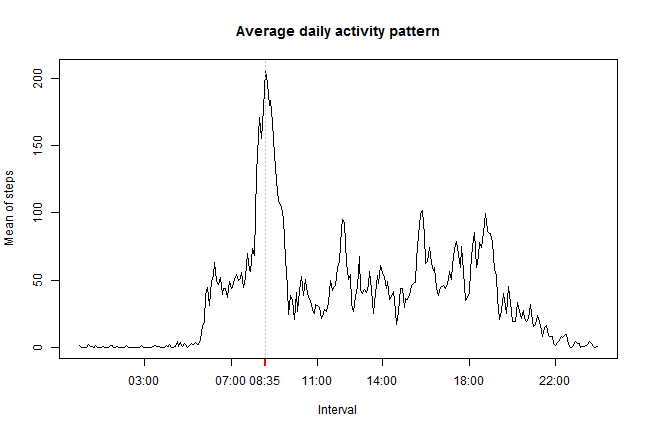
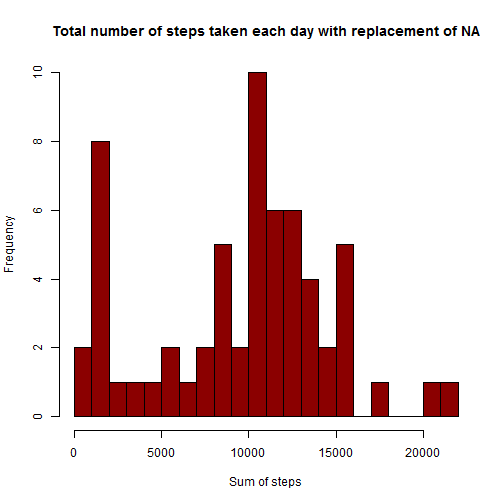
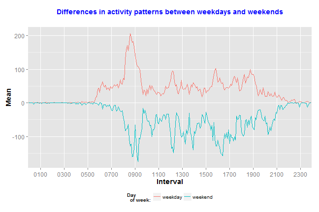

# "Reproducible Research - PA1"   
**author: V.Kirilenko**

  
  
This assignment makes use of data from a personal activity monitoring device. This device collects data at 5 minute intervals through out the day. The data consists of two months of data from an anonymous individual collected during the months of October and November, 2012 and include the number of steps taken in 5 minute intervals each day.  

### _Loading and preprocessing the data_

```r
url1 = "http://d396qusza40orc.cloudfront.net/repdata/data/activity.zip"
temp = tempfile()
download.file(url1, temp)
activity = read.csv(unz(temp, "activity.csv"))
unlink(temp)
```
  
  
### First question: what is mean total number of steps taken per day?

**_1. Plot total number of steps taken each day and calculate mean & median_**  

```r
steps = aggregate(activity$steps, by=list(activity$date), sum, na.rm=TRUE)
names(steps) = c("Date","Sum_of_steps")
hist(steps$Sum_of_steps,breaks = 30, freq = T, col = "darkred", xlab = "Sum of steps",
     main = paste("Total number of steps taken each day"))
```

 

**_2. Calculate and report the mean and median total number of steps taken per day_**  

```r
matrix(c(mean(steps$Sum_of_steps),median(steps$Sum_of_steps)),nrow = 1, ncol = 2,
       dimnames = list(("Steps"),c("Mean","Median")))
```

```
##          Mean Median
## Steps 9354.23  10395
```
  
  
### Second question: what is the average daily activity pattern?  
**_1. Plot means of steps by interval_**  
So, there are the gaps between 55 min and 00 min.  
Program get it as 45-length interval and plot interpolated line from the first value to the second value.  
To avoid this, I created an extra column, which has the intervals converted to time intervals.  

```r
l = length(activity[,3])
for(i in 1:l){
  while (nchar(activity[i,3])<4)
    activity[i,3] = paste(as.character(0),as.character(activity[i,3]),sep ="")}
interval = aggregate(activity$steps, by=list(activity$interval), mean, na.rm=TRUE)
interval$Time = strptime((interval[,1]), format = "%H%M")
names(interval) = c("Interval","Mean","Time")
max_interval = (interval[which(grepl(max(interval$Mean), interval$Mean)),3])
plot(interval$Time, interval$Mean, type="l", xlab="Interval", xaxt="n", ylab="Mean of steps",
     main = paste("Average daily activity pattern"))
abline(v=axis.POSIXct(1, at = max_interval,col = "red",lwd = 2),col = "gray", lty = "dotted",lwd = par("lwd"))
axis.POSIXct(side = 1, at = c(interval[37,3],interval[85,3], interval[133,3],interval[169,3], 
                              interval[217,3],interval[265,3]))  
```

 
  
The 5-minute interval that contains, in average, the maximum number of steps is **08:35.**  
  
### Third question: imputing missing values  
**_1. Calculating sum of NA in dataset_**  

```r
sum(is.na(activity))
```

```
## [1] 2304
```

**_2. Imputing NA in dataset_**   
I choose the median of steps as data for replacing data NA values.  
I think that median is more stable with deviations than the mean.  
So, I got medians of steps each day and exchanged them with NA values where they were present.  

```r
act_temp = aggregate(steps ~ interval, data=activity, median)
names(act_temp)[2] = "medianSteps"
new_act = merge(activity, act_temp)
new_act$steps[is.na(new_act$steps)] = new_act$medianSteps[is.na(new_act$steps)]
median_steps = aggregate(new_act$steps, by=list(new_act$date), sum)
names(median_steps) = c("Date","Sum_of_steps")
```

**_3. Plot new dataset and calculating new mean & median_**  

```r
hist(median_steps$Sum_of_steps,breaks = 30, freq = T, col = "darkred", xlab = "Sum of steps",
     main = paste("Total number of steps taken each day with replacement of NA"))
```

 

```r
matrix(c(c(mean(steps$Sum_of_steps), mean(median_steps$Sum_of_steps)),c(median(steps$Sum_of_steps), 
 median(median_steps$Sum_of_steps))),nrow = 2, ncol = 2, dimnames = list(c("Steps with NA","Steps w/o NA"),
                                                                         c("Mean","Median")))
```

```
##                   Mean Median
## Steps with NA 9354.230  10395
## Steps w/o NA  9503.869  10395
```

**_4. Also we can check sums of steps in whole datasets:_**  

```r
old_sum = sum(activity$steps,na.rm = T)
new_sum = sum(new_act$steps)
ratio = paste(format(round(((new_sum/old_sum)-1)*100, 2), nsmall = 2),"%")
matrix(c(old_sum,new_sum),nrow = 1, ncol = 2,
       dimnames = list(("Sum of steps"),c("Old","New")))
```

```
##                 Old    New
## Sum of steps 570608 579736
```
As we can see, impact of imputing missing data on the total daily number of steps is very small.  
Difference between sums of steps (and means of steps also) is only **1.60 %**.  
  
  
### Fourth question: are there differences in activity patterns between weekdays and weekends?  
**_1. Calculate differences in activity patterns and merge the data_**  

```r
activity$Date_Time = strptime(paste(activity$date, activity$interval), format = "%Y-%m-%d %H%M")
activity$weekdays = weekdays(activity[,4])
weekend = subset(activity, activity$weekdays %in% c("Saturday","Sunday"))
weekday = subset(activity, !(activity$weekdays %in% c("Saturday","Sunday")))
intWE = aggregate(weekend$steps, by=list(weekend$interval), mean, na.rm=TRUE)
```

```
## Error in aggregate.data.frame(as.data.frame(x), ...): no rows to aggregate
```

```r
intWE$day = "weekend"
intWD = aggregate(weekday$steps, by=list(weekday$interval), mean, na.rm=TRUE)
intWD$day = "weekday"
all_data = rbind(intWE,intWD)
names(all_data) = c("Interval","Mean","Day")
all_data$Mean[all_data$Day == "weekend"] = -all_data$Mean[all_data$Day == "weekend"]
```

**_2. Plot difference by types of days_**  

```r
library("ggplot2")
ggplot(all_data, aes(group = Day,Interval,Mean, col = Day)) + geom_line() + 
  ggtitle(expression(atop(bold("Differences in activity patterns between weekdays and weekends")))) +
  theme(plot.title=element_text(color="blue"),legend.position="bottom")+ scale_colour_hue(name = "Day
  of week:") + theme(axis.text=element_text(size=12), axis.title=element_text(size=14,face="bold")) +
  scale_x_discrete(breaks=c("0100", "0300", "0500", "0700", "0900", "1100", "1300",
                            "1500", "1700", "1900", "2100", "2300"))
```

 
  
**Last edition: 21:01:50 13/03/2015**
